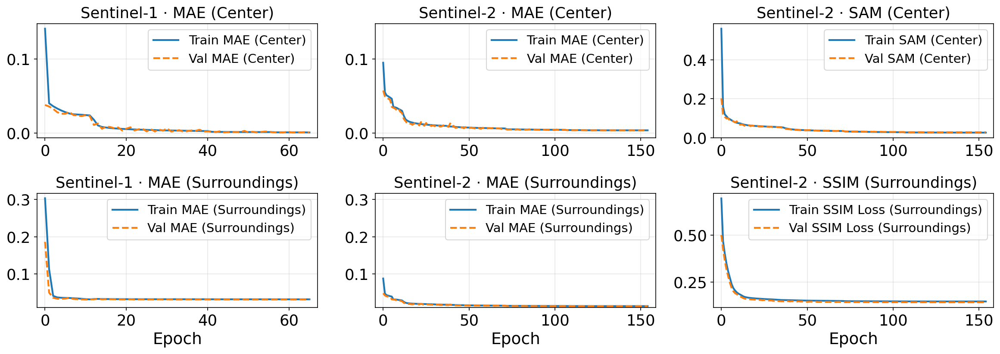

# Training Module

This module contains the training and training-related evaluation scripts for the two-stage representation learning setup.

## Scope

The training is split into two stages:

1. modality-specific training
2. fusion training

Both stages consume the HDF5 datasets created by the [`dataset`](../dataset/README.md) module and use the model definitions from the [`model`](../model/README.md) module.

## Scripts

### 1. Modality-specific training

Execute [`train_modality.py`](train_modality.py).

This script trains a single-modality autoencoder with [`TransformerAE`](../model/model_s1_s2.py). Set `MODALITY` to `s1` or `s2` in the script before running it.

Inputs:
- `train_s1.h5` / `val_s1.h5`
- `train_s2.h5` / `val_s2.h5`

Outputs:
- checkpoints in `checkpoints/modality/s1/`
- checkpoints in `checkpoints/modality/s2/`

### 2. Fusion training

Execute [`train_fusion.py`](train_fusion.py).

This script trains the shared fusion model with [`FusedS1S2`](../model/model_fusion.py). It loads the best available modality-specific checkpoints automatically and uses them to initialize the fusion stage.

Inputs:
- `train_s1_s2.h5`
- `val_s1_s2.h5`
- best checkpoints from `checkpoints/modality/s1/` and `checkpoints/modality/s2/`

Outputs:
- best fusion checkpoint in `checkpoints/fusion/s1_s2/fuse_model.ckpt`

### 3. Checkpoint validation

Execute [`validate.py`](validate.py) if held-out evaluation is needed.

This script validates the configured best checkpoint for `s1`, `s2`, or `fusion` on the corresponding test HDF5 dataset. Set `MODE` in the script before running it.

### 4. Loss visualization

Execute [`plot_loss.py`](plot_loss.py) to visualize logged training curves.

This script reads Lightning `metrics.csv` files and creates summary plots for the modality-specific training runs.

